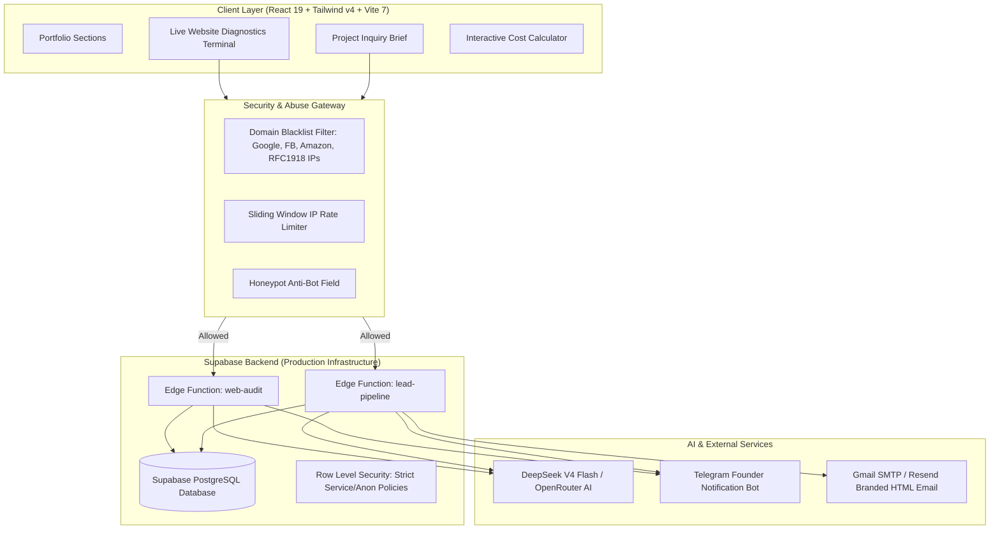

# Rymthos Dev — Master Architecture & Production Roadmap

## Overview & Executive Vision
Transform **Rymthos Dev** from a locally-targeted portfolio into an **international digital production house** with enterprise-grade architecture, high-conversion branding, and two signature conversion engines:
1. **Real-Time Website Auditor & Debugger**: An instant, deep diagnostic tool that detects site category, uncovers critical bugs (such as broken e-commerce checkout, missing account creation, and security vulnerabilities), estimates lost revenue, and converts visitors on the spot.
2. **Advanced AI Executive Assistant**: Automated triage, lead scoring, personalized scope analysis, branded HTML email dispatch, and instant Telegram founder alerts.

All backend services will be deployed securely on **Supabase** (PostgreSQL with Row Level Security + Edge Functions) with zero frontend credential exposure.

---

## Strategic Phases

| Phase | File | Focus |
| :--- | :--- | :--- |
| **01** | `planning/01-international-positioning.md` | Strip Saudi-specific markers; establish global USD standard; create relatable Bangladesh bridge. |
| **02** | `planning/02-supabase-backend-architecture.md` | PostgreSQL schema (`leads`, `audit_reports`), Row Level Security, and Edge Functions. |
| **03** | `planning/03-advanced-web-audit-debugger.md` | Live site scraping, SSRF/abuse blacklist, e-commerce flaw detection, revenue leakage estimation, bilingual Banglish insights. |
| **04** | `planning/04-ai-assistant-email-pipeline.md` | DeepSeek/OpenRouter intelligence, branded portfolio HTML email template, Telegram instant push notifications. |
| **05** | `planning/05-testing-verification-runbook.md` | Local build verification, dependency resolution, end-to-end audit validation, deployment guide. |

---

## System Architecture Diagram

